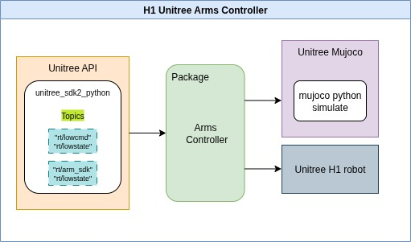

# G1 Arms Controller
This repository includes two modular Python packages for controlling the [Unitree G1 humanoid robot](https://www.unitree.com/g1/):

The package supports dual-arm motion, forward/inverse kinematics using Pinocchio, and structured logging/plotting tools. The project is ROS-free and tested in both Unitree Mujoco simulator and hardware.

---

## 🧩 System Overview



## 📚 Table of Contents

- [Features](#features)
- [Requirements](#requirements)
- [Dependencies Installationion](#dependencies-installation)
- [Project Structure](#project-structure)
- [Package Breakdown](#package-breakdown)
- [Demo Files](#demo-files)


---
## Features

- Inverse & Forward Kinematics using [Pinocchio](https://stack-of-tasks.github.io/pinocchio/) and CasADi
- Joint control via DDS messaging using [Unitree SDK2 Python](https://github.com/unitreerobotics/unitree_sdk2_python)
- Fully tested with the **Unitree Mujoco simulator** using [Unitree_mujoco](https://github.com/unitreerobotics/Unitree_mujoco)
- Work on both simulator and real-robot
- Clean modular architecture designed for **dual-arm manipulation tasks**
- Research-friendly, ROS-free standalone design

## Requirements

- Python ≥ 3.8
- NumPy 1.21.5 < 2.0 (required for Pinocchio compatibility)
- [Pinocchio](https://stack-of-tasks.github.io/pinocchio/download.html)
- CasADi 3.7.0
- SciPy 1.8.0
- unitree_sdk2py (official Unitree Python SDK)
- Unitree Mujoco Simulator (for simulation)

## Dependencies Installation
### 1. Install Unitree SDK2 Python

```bash
cd ~
sudo apt install python3-pip
git clone https://github.com/unitreerobotics/unitree_sdk2_python.git
cd unitree_sdk2_python
pip3 install -e .
``` 
### 2. Install Unitree Mujoco (Python-based simulation)

```bash
pip install mujoco
pip install pygame

cd ~
git clone https://github.com/unitreerobotics/unitree_mujoco.git
```
### 3.  Install CasADi, SciPy libraries
```bash
pip install casadi scipy
```
### 4. Install NumPy < 2.0 (required for Pinocchio)
```bash
pip install numpy==1.26.4
```
### 5. Install Pinocchio using robotpkg
Follow this official guide:

👉 https://stack-of-tasks.github.io/pinocchio/download.html

Then, set up your environment:
```bash
echo 'export PATH=/opt/openrobots/bin:$PATH' >> ~/.bashrc
echo 'export PKG_CONFIG_PATH=/opt/openrobots/lib/pkgconfig:$PKG_CONFIG_PATH' >> ~/.bashrc
echo 'export LD_LIBRARY_PATH=/opt/openrobots/lib:$LD_LIBRARY_PATH' >> ~/.bashrc
echo 'export PYTHONPATH=/opt/openrobots/lib/python3.10/site-packages:$PYTHONPATH' >> ~/.bashrc
echo 'export CMAKE_PREFIX_PATH=/opt/openrobots:$CMAKE_PREFIX_PATH' >> ~/.bashrc

source ~/.bashrc
```
### 6. Clone This Repository and Set Python Path 
```bash
cd ~
git clone https://github.com/Yara-NM/h1_arms_controller.git
cd  /path to this repo/ 
pip install -e .
```
## 7. Set up the simulator with G1 
Edit the config file:
```bash
nano ~/unitree_mujoco/simulate_python/config.py
```
Change these lines:
```python
ROBOT = "G1"
USE_JOYSTICK = 0
ENABLE_ELASTIC_BAND = True
```
Run the simulator, Mujoco simulator should run with Unitree H1 robot:
```bash
cd ~/unitree_mujoco/simulate_python
python3 unitree_mujoco.py
```

🕹️ Controls in simulation:

9 — Enable/disable elastic band

7 / 8 — Lift/lower robot

## Project Structure

```text
g1/
├── arms_controller/
│    ├── __init__.py
│    ├── g1_ik_solver_with_vis.py
│    ├── ...
│    ├── assets/
│         └── g1/
│             ├── g1_body29_hand14.urdf
│             └── ... (mesh files etc.)
├── demo/
├── setup.py
└── MANIFEST.in
```

---
## Package Breakdown

Each control package (low/high) contains:

- `g1_robot_controller.py`: Unified interface to IK, joint control, logging, plotting
- `joint_controller.py`: Main control logic (support both low-level or high_levle topics)
-  `joint_controller_2layers.py`: there is another interpolation layer to control the trajectory in joint-space 
- `ik_solver.py`: CasADi-based inverse kinematics using Pinocchio
- `plotting.py`: Saves joint position/velocity/torque as SVG with timestamps
- `utils.py`: Math tools (quat, RPY, rotvec), joint name remapping

---

## Demo Files

- `demo/g1_camera_intrinsics.json` : Camera calibration file (3×3 intrinsic matrix and distortion coefficients) used for accurate ArUco pose estimation and pixel→metric projection.

- `demo/cam_based_manipulation_test.py` : Threaded demo that detects ArUco markers with the head camera, converts marker pose from camera to pelvis (base) using URDF-fixed transforms, and moves the left arm to a target offset above marker ID=0 while keeping the right arm at its initial pose.
it will open realsence viewr on the host PC 


### Remote Instructions


